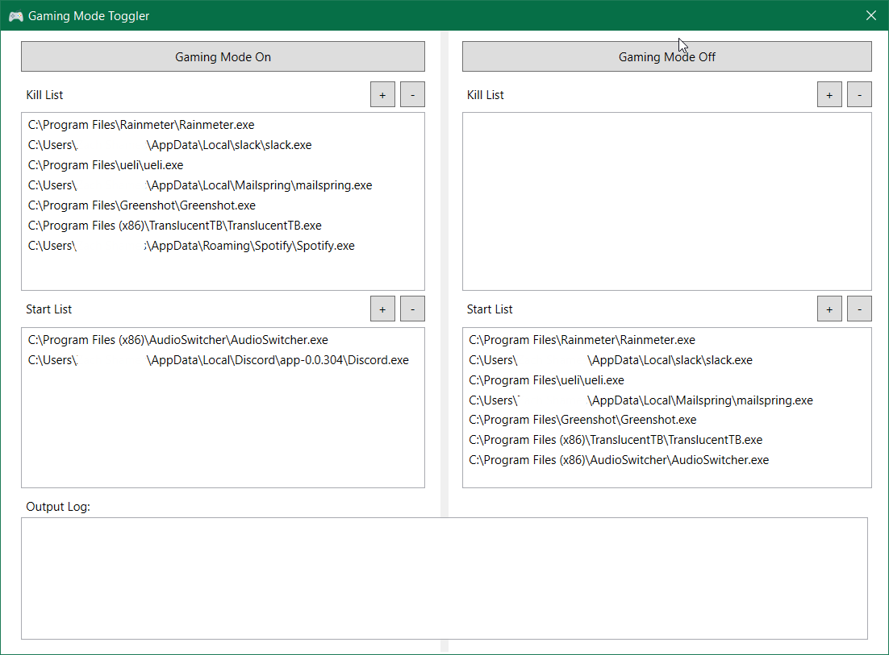

# Gaming Mode Toggler

This is a small windows application to toggle a customizable "gaming mode". Basically, this app is a fancy way of killing and starting specified processes. The app gives you a UI divided into 2 sides, one for turning on "gaming mode" and one for turning off "gaming mode". On each side, there is a start list and a kill list. These lists contains the paths to applications you want to kill and start when you enable/disable gaming mode. You may add or remove applications to customize your "gaming mode".

## Purpose

The reason I made this application is because I always found myself killing the same programs whenever I wanted to start gaming. And it isn't just one or 2 apps, it's usually a bunch of them. And then when I was done gaming, I had to start them all back up again. This was getting annoying so I made an app to assist me. I never did any research to see if there were apps out there to do it already. To be honest, I was kind of bored and wanted to make an app myself. Something that was lightweight and I knew exactly what it was doing.

## Screenshot

## Notes

- By default, there are a few apps that get preloaded into the start/kill lists. However, these will only get loaded if they are installed on your machine. There very well could be no applications in your lists when you first open it up.
- When you close the application, your current lists will be saved automatically and loaded up the next time the application is run
- This app uses a simple Process.Kill() call to kill apps and a simple Process.Start() call to start apps. So if a process you need to kill requires Admin priviledges, please run this app as an Administrator

## Disclaimer

I am not normally a C# developer. If my code style or coding methodology should be different, feel free to let me know and I'll see what I can do to change it. Yes, I know the UI isn't the most pleasing thing to look at. I'm no designer. I just wanted it to be functional.
